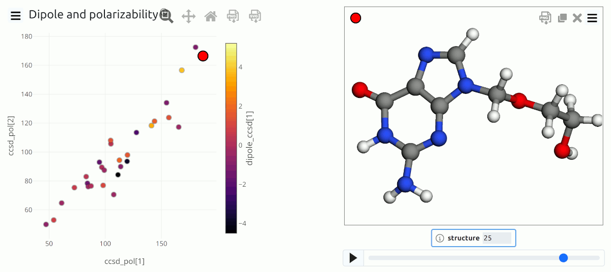
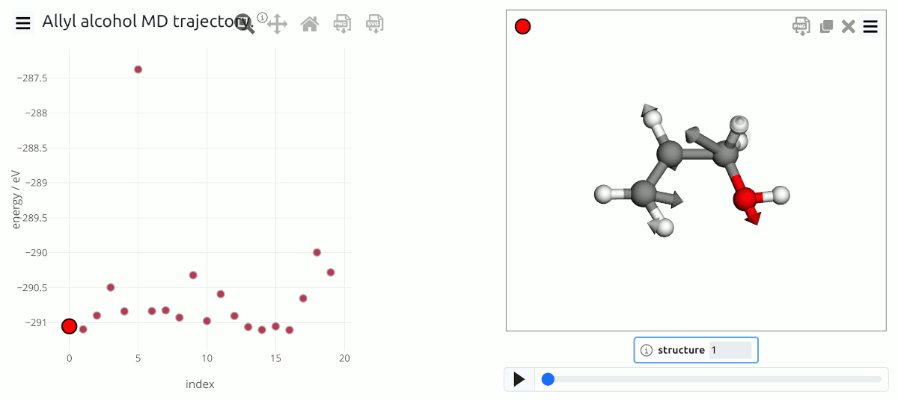
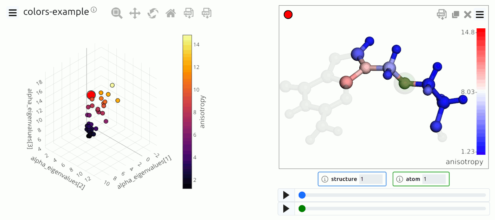
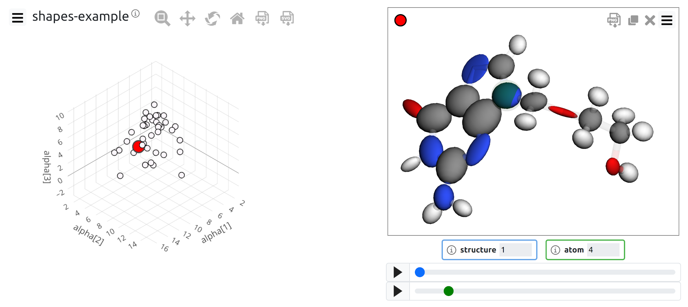

.. _examples:

Examples
========

This page lists a few examples of visualizations based on chemiscope. 
Rather than providing a demonstration of a scientifc application, as for the 
examples on `the main page <http://chemiscope.org>`_, these examples
consist in short Python scripts that demonstrate how to make a chemiscope
viewer file that uses some particular features (e.g. atom coloring or shape
visualization). 

.. raw:: html

    <h2>Basic usage</h2>

    Trajectory data from a MD simulation of allyl alcohol, including 
    visualization of force data
    
.. raw:: html

   

   
<b> ▶ Show source code...</b>

   
.. literalinclude:: ../../python/examples/base.py
    :language: python

.. raw:: html

   

   

.. raw:: html

    <h2>Trajectory data</h2>

.. figure:: img/example_pca.png
    :align: center

    Trajectory data from a MD simulation of allyl alcohol, including 
    visualization of force data

.. raw:: html

   

   
<b> ▶ Show source code...</b>

       
.. literalinclude:: ../../python/examples/trajectory.py
    :language: python

.. raw:: html

   

       

.. raw:: html

    <h2>Structure-property maps</h2>

    PCA map of the atomic environments in a dataset of allyl alcohol configurations

.. raw:: html

   

   
<b> ▶ Show source code...</b>

   
.. literalinclude:: ../../python/examples/structure_map.py
    :language: python

.. raw:: html

   

   
       
.. raw:: html

    <h2>Color atoms by property</h2>       

    Atom coloring based on the values of a local property

.. raw:: html

   

   
<b> ▶ Show source code...</b>

   
.. literalinclude:: ../../python/examples/colors.py
    :language: python

.. raw:: html

   

   
   
.. raw:: html

    <h2>Add shapes to visualize data</h2>

    Visualization of atomic and molecular data using vectors, ellipsoids ... and more

.. raw:: html

   

   
<b> ▶ Show source code...</b>

   
.. literalinclude:: ../../python/examples/shapes.py
    :language: python

.. raw:: html

   

