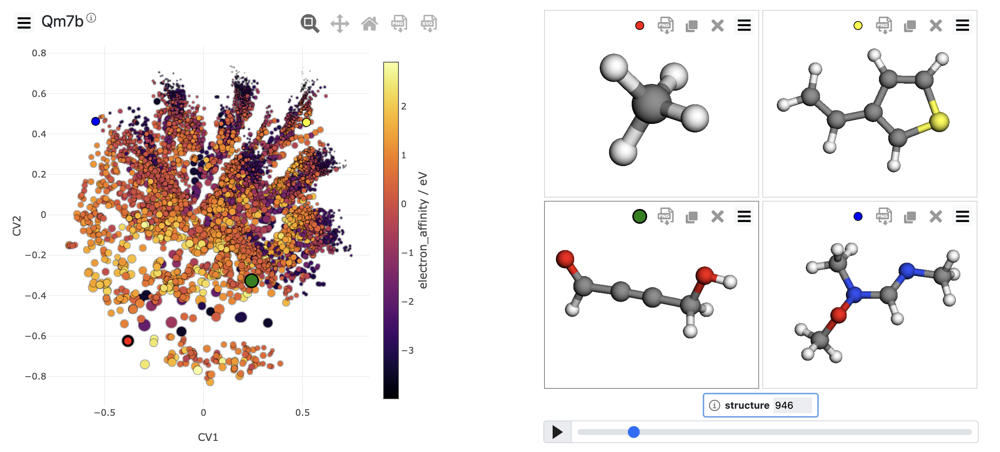

Chemiscope: interactive structure/property explorer for materials and molecules
===============================================================================

Welcome to the documentation of the `chemiscope`_ visualization tool, an
interactive structure/property explorer for materials and molecules. The goal of
chemiscope is to provide interactive exploration of large databases of materials
and molecules and help researchers to find structure-properties correlations
inside such databases. The screenshot below shows an example of such database
being visualized with chemiscope. The first part of this documentation describes
the default interface of chemiscope and how to use it with your own database.

    Screenshot of the `Qm7b`_ database visualized in the default chemiscope viewer

Chemiscope is built around re-usable components, that can be arranged in
different manners to create visualization adapted to different kinds of data. The
second part of this documentation explains how to build the code and use it in
your own website to create new interfaces.

Citing chemiscope
-----------------

Chemiscope is distributed under an open-source license, and you are welcome to
use it and incorporate it into your own research and software projects. 
If you find it useful, we would appreciate a citation to the chemiscope 
`paper`_:

G. Fraux, R. K. Cersonsky, M. Ceriotti, *Chemiscope: Interactive
Structure-Property Explorer for Materials and Molecules.* **Journal of Open
Source Software** 5 (51), 2117 (2020)

If you incorporate chemiscope components into a software project, a link
back to the `chemiscope`_ homepage is the preferred form of acknowledgement. 

What's in this documentation?
-----------------------------

.. toctree::
    :maxdepth: 2

    tutorial
    embedding

.. _chemiscope: https://chemiscope.org
.. _paper: https://doi.org/10.21105/joss.02117
.. _Qm7b: https://doi.org/10.1088/1367-2630/15/9/095003
