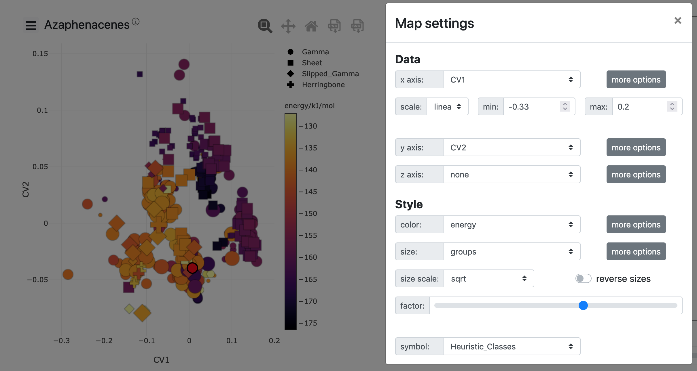

User tutorial
=============

This tutorial will present how to use the `default chemiscope visualizer
<chemiscope_>`_ with your own database: the different panels and related
settings; as well as how to create an input file for it.

.. _chemiscope: https://chemiscope.org

Introduction to structural properties
^^^^^^^^^^^^^^^^^^^^^^^^^^^^^^^^^^^^^

Before we get started, we will introduce a few concepts that underlie the
concept and the usage of chemiscope. Chemiscope is designed to help navigating
*structure-property maps*, i.e. 2D or 3D representations of a set of
atomic scale entities that reflect how structure influences materials
properties.

Chemiscope can work with two kinds of entities: full structures, or
atom-centred environments. A structure consists in a set of atoms, possibly
representing the periodic repeat unit of an infinite structure. An
environment consists in a set of atoms that surround a central atom,
In both cases, these entities are fully defined by the position and nature
of the atoms present in the structure, or in the neighborhood of the
environment center.

For each structure or environment, one may have computed *properties*,
e.g. the cohesive energy of a molecule, or the NMR chemical shielding of
a nucleus, or *structural representations*, i.e. functions of the
spatial arrangement of the atoms that incorporate some fundamental
symmetries to achieve a description of the structure that is as complete
as possible, yet concise. Examples of such representations are for instance
`atom density representationis <soap>`_ or `Behler-Parrinello
symmetry functions <Behler-Parrinello>`_. These representations are usually
high-dimensional vectors, hard to visualize and interpret. For this reason, one
usually applies a dimensionality reduction algorithm, such as `PCA`_, `sketch-map`_,
*etc.*   The interpretation of the resulting  will differ depending on both the
descriptor used to represent the structures or environments and the
dimensionality reduction algorithm applied.

Chemiscope simplifies visualizing the correlations between structural
representations and properties associated with structures and environments,
by representing in an interactive fashion these atomic-scale entities as points
on a map, and by associating these points with an explicit, 3D visualization
of the structure of the material or molecule.

.. figure:: img/mol-to-map.*
    :width: 65 %

    Illustration of the process used to create structural properties from a
    molecule.

Chemiscope is completly agnostic with respect to how properties and structural
representations are generated, and do not provide any facilities to generate them.
In the rest of this document, we will refer to properties describing
the structure of an environment or structure as *structural properties*
and other associated properties associated (such as energy, density, ...) as
*physical properties*.

.. _soap: https://doi.org/10.1063/1.5090481
.. _Behler-Parrinello: https://doi.org/10.1103/physrevlett.98.146401
.. _PCA: https://en.wikipedia.org/wiki/Principal_component_analysis
.. _sketch-map: https://doi.org/10.1073/pnas.1108486108

Different panels and settings
^^^^^^^^^^^^^^^^^^^^^^^^^^^^^

The default chemiscope visualizer is organized in three main panels: the map,
the structure viewer and the environment information display. Additionally,
clicking on the dataset title (on top of the map) will display some metadata
about the dataset (description, authors, references). This section will
present each one, as well as the main settings accessible to customize the
display.

The map is a 2D or 3D scatter plot showing properties for all the environments
in the dataset. You can set which properties (structural or physical) should be
used a the x, y, and potentially z axis; as well as for color and size of the
points. Additionally, properties which have string values (an not numeric
values) can be used as category data to set the symbols used for the points. To
open the settings modal window, click on the hamburger menu (the ☰ symbol) on
the left of the dataset title.

    The map panel in 2D mode and the related settings

The structure panel is a 3D molecular viewer based on `Jmol`_. The settings are
accessible through the hamburger menu (☰) on the right of the viewer. The
settings are grouped into **representation** (how is the molecule rendered);
**supercell** (how many copies of the unit cell to display); **environments**
(how atom-centered environments are displayed); **camera** (reset the camera in
along one of the given axis); and **trajectory** (playback related settings).

.. figure:: img/structure.png
    :width: 80 %

    The structure panel and related settings

Finally, the environments information panel features sliders and text input to
allow for an easy selection of the environment of interest. The play button on
the left of the sliders activates the trajectory playback, looping over the
structures in the datasets or the atoms in a structure. By clicking on the
labels at the top (*structure XXX* and*atom XXX*), one can hide or show the
full property tables. These tables show all properties in the dataset for the
currently selected environment.

.. figure:: img/info.png
    :width: 40 %

    The environment information panel fully expanded

.. _Jmol: http://jmol.org

Input file format for chemiscope
^^^^^^^^^^^^^^^^^^^^^^^^^^^^^^^^

When using the default chemiscope interface, all the structures and properties
in a dataset are loaded from a single JSON file. This sections describe how to
generate such JSON file, either using a pre-existing python script that does
most of the work for you, or by writing the JSON file directly. Since the
resulting JSON file can be quite large and thus harder to share with
collaborators, the default chemiscope interface also allows to load JSON files
compressed with gzip.

Creating an input file
----------------------

The easiest way to create a JSON input file is to use the ``chemiscope``
package. Install the package with ``pip install chemiscope``, and use
:py:func:`chemiscope.write_input` or :py:func:`chemiscope.create_input` in your
own script to generate the JSON file. This script assumes you use the `ase`_
Python module to read the structures.

If all the properties you want to include into chemiscope are already stored in
a file `ase`_ can read, the ``chemiscope`` python package also install a
``chemiscope-input`` command line script. Note that chemiscope does not compute
structural representations or dimensionality reduction. The `ASAP`_ structural
analysis package is another tool that can directly generate an output in
chemiscope format.

.. autofunction:: chemiscope.write_input

.. autofunction:: chemiscope.create_input

.. _ase: https://wiki.fysik.dtu.dk/ase/index.html
.. _ASAP: https://github.com/BingqingCheng/ASAP

Input file structure
--------------------

If you can not or do not want to use the script mentioned above, you can also
directly write the JSON file conforming to the schema described here. The input
file follows closely the `Dataset`_ typescript interface used in the library.
Using a pseudo-JSON format, the file should contains the following fields and
values:

.. code-block:: javascript

    {
        // metadata of the dataset. `description`, `authors` and `references`
        // will be rendered as markdown.
        "meta": {
            // the name of the dataset
            "name": "this is my name"
            // description of the dataset, OPTIONAL
            "description": "This contains data from ..."
            // authors of the dataset, OPTIONAL
            "authors": ["John Doe", "Mr Green, green@example.com"],
            // references for the dataset, OPTIONAL
            "references": [
                "'A new molecular construction', Journal of Random Words 19 (1923) pp 3333, DOI: 10.0000/0001100",
                "'nice website' http://example.com",
            ],
        },

        // list of properties in this dataset
        "properties": {
            // Each property have at least a name, a target and some values.
            // Optional entries for the units and descriptions can also be added.
            <name>: {
                // the property target: is it defined per atom or for the full
                // structures
                "target": "atom" | "structure",
                // values of the properties can either be numbers or strings.
                // string properties are assumed to represent categories of
                // data.
                "values": [1, 2, 3, ...] | ["first", "second", "first", ...],

                // OPTIONAL: units of the property' value
                "units": "A/fs^2",
                // OPTIONAL: free-form description of the property as a string
                "description": "acceleration of the atoms in the structure ...",
            }
        }

        // list of structures in this dataset
        "structures": [
            {
                // number of atoms in the structure
                "size": 42,
                // names of the atoms in the structure
                "names": ["H", "O", "C", "C", ...],
                // x cartesian coordinate of all the atoms, in Angstroms
                "x": [0, 1.5, 5.2, ...],
                // y cartesian coordinate of all the atoms, in Angstroms
                "y": [5.7, 7, -2.4, ...],
                // z cartesian coordinate of all the atoms, in Angstroms
                "z": [8.1, 2.9, -1.3, ...],
                // OPTIONAL: unit cell of the system, if any.
                //
                // This should be given as [ax ay az bx by bz cx cy cz], where
                // a, b, and c are the unit cell vectors. All values are
                // expressed in Angstroms.
                "cell": [10, 0, 0, 0, 10, 0, 0, 0, 10],
            },
            // other structures as needed
            ...
        ],

        // OPTIONAL: atom-centered environments descriptions
        //
        // If present, there should be one environment for each atom in each
        // structure.
        "environments": [
            {
                // index of the structure in the above structures list
                "structure": 0,
                // index of the central atom in structures
                "center": 8,
                // spherical cutoff radius, expressed in Angstroms
                "cutoff": 3.5,
            },
            // more environments
            ...
        ]

        // OPTIONAL: setting for each panel
        //
        // Adding these values allow to setup how a given dataset should be
        // visualized in chemiscope.
        //
        // Each value inside the settings group is optional
        "settings": {
            // settings related to the map
            "map": {
                // x axis settings
                "x": {
                    // name of the property to use for this axis, this must be
                    // one of the key from the root `properties` table.
                    "property": "<name>",
                    // should the axis use linear or logarithmic scaling
                    "scale": "linear" | "log",
                    // lower bound of the axis
                    "min": -0.23,
                    // upper bound of the axis
                    "max": 1.42,
                },
                // y axis setting, using the the same keys as x axis setting
                "y": {
                    // ...
                },
                // z axis setting, using the the same keys as x axis setting
                "z": {
                    // property can be set to an empty string to get a 2D map
                    "property": "",
                    // ...
                },
                // name of the property to use for markers symbols, this must be
                // one of the key from the root `properties` table. The
                // associated property should have string values
                "symbol": "<name>",
                // point color setting, using the the same keys as x axis setting
                "color": {
                    // property can be set to an empty string for uniform color
                    "property": "",
                    // ...
                },
                // Color palette to use, default to 'inferno'
                "palette": "cividis",
                // settings related to the markers sizes
                "size": {
                    // scaling factor for the axis, between 1 and 100
                    "factor": 55,
                    // mode to scale the markers with respect to the properties
                      // `constant`: all markers are same size, scaled by `factor`
                      // `linear`: markers are directly proportional to the property
                      // `log`: markers are proportional to the logarithm of the property
                      // `sqrt`: markers are proportional to the square root of the property
                      // `inverse`: markers are inversely proportional to the property
                    "mode": "constant" | "linear" | "log" | "sqrt | "inverse"",
                    // name of the property to use for the markers size, this
                    // must be one of the key from the root `properties` table.
                    "property": "<name>",
                    // if false, markers scale from smallest to largest property value
                    // if true, marker scale from largest to smallest property value
                    // in the case of `inverse` scaling, this is reversed.
                    "reverse": false | true,
                },
            },
            // Settings related to the structure viewers grid. This is an array
            // containing the settings for each separate viewer
            "structure": [
                {
                    // show bonds between atoms
                    "bonds": true,
                    //use space filling representation
                    "spaceFilling": false,
                    // show atoms labels
                    "atomLabels": false,
                    // show unit cell information and lines
                    "unitCell": false,
                    // displayed unit cell as a packed cell
                    "packedCell": false,
                    // number of repetitions in the `a/b/c` direction for the supercell
                    "supercell": [2, 2, 3],
                    // make the molecule spin
                    "rotation": false,
                    // which axis system to use
                    "axes": "none" | "xyz" | "abc",
                    // keep the orientation constant when loading a new structure
                    "keepOrientation": false,
                    // options related to atom-centered environments
                    "environments": {
                        // should we display environments & environments options
                        "activated": true,
                        // automatically center the environment when loading it
                        "center": false,
                        // the cutoff value for spherical environments
                        "cutoff": 3.5
                        // which style for atoms not in the environment
                        "bgStyle": "licorice" | "ball-stick" | "hide",
                        // which colors for atoms not in the environment
                        "bgColor": "grey" | "CPK",
                    };
                },
                // ...
            ]
            // List of environments to display (up to 9). These environments
            // will be shown in the structure viewer grid and indicated on
            // the map.
            //
            // This list should containg 0-based indexes of the environment in
            // the root "environments" object; or of the structure in the root
            // "environments" if no environments are present.
            //
            // If both this list and the "structure" settings list above are
            // present, they should have the same size and will be used together
            // (first element of "structure" setting used for the first "pinned"
            // value; and so on).
            //
            // This defaults to [0], i.e. showing only the first
            // environment/structure.
            "pinned": [
                33, 67, 12, 0,
            ]
        }
    }

.. _Dataset: api/interfaces/main.dataset.html

Using the standalone visualizer
^^^^^^^^^^^^^^^^^^^^^^^^^^^^^^^

The default chemiscope interface lives online, at https://chemiscope.org/. But
there are some cases where you do not want to use an online tool for your own
dataset, such as scientific article supplementation information. For these use
cases, a standalone, mostly offline visualizer exists that uses the same input
file format as the default interface. You can download the latest version of the
standalone viewer at
:download:`https://chemiscope.org/chemiscope_standalone.html`.

This file contains all the required HTML and JavaScript code for chemiscope.
You can then add your own dataset by adding the corresponding JSON file at the
end of the ``chemiscope_standalone.html`` file.

.. code-block:: bash

    cat chemiscope_standalone.html my-dataset.json > my-dataset.html

To re-build the ``chemiscope_standalone.html`` file from sources, please follow
the steps below:

.. code-block:: bash

    git clone https://github.com/cosmo-epfl/chemiscope
    cd chemiscope
    npm install
    npm run build
    python3 ./utils/generate_standalone.py
