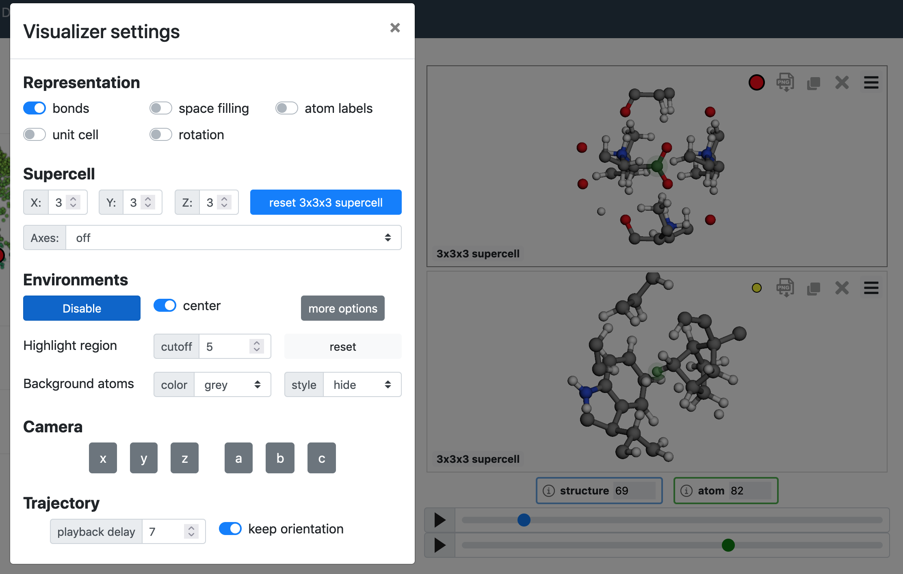
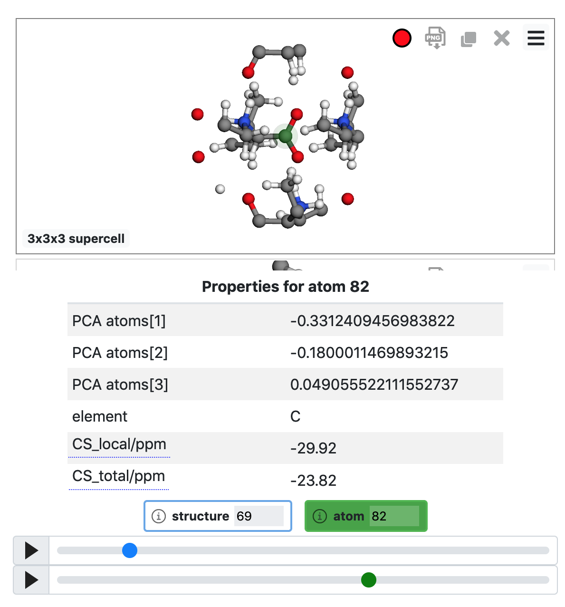

User tutorial
=============

This tutorial will present how to use the `default chemiscope visualizer
<chemiscope_>`_ with your own database: the different panels and related
settings; as well as how to create an input file for it.

.. _chemiscope: https://chemiscope.org

TODO: basics: environments, structure/atom, properties, descriptors, dim reduction

Different panels and settings
^^^^^^^^^^^^^^^^^^^^^^^^^^^^^

The default chemiscope visualizer is organized in three main panels: the map,
the structure viewer and the environment information display. This section will
present each one, as well as the main settings accessible to customize the
display.

The map is a 2D or 3D scatter plot showing structural or physical properties for
all the environments in the dataset. You can set which properties should be used
a the x, y, and potentially z axis; as well as for color and size of the points.
Additionally, string properties can be used as category data to set the symbols
used for the points. To open the settings modal window, click on the hamburger
menu (the ☰ symbol) on the left of the dataset title.

.. figure:: img/map.png
    :width: 80 %

    The map panel in 2D mode and the related settings

The structure panel is a 3D molecular viewer based on `Jmol`_. The settings are
accessible through the hamburger menu (☰) on the right of the viewer. The
settings are grouped into **representation** (how is the molecule rendered);
**supercell** (how many copies of the unit cell to display); **environments**
(how atom-centered environments are displayed); **camera** (reset the camera in
along one of the given axis); and **trajectory** (playback related settings).

    The structure panel and related settings

Finally, the environments information panel features sliders and text input to
allow for an easy selection of the environment of interest. The play button on
the left of the sliders activates the trajectory playback, looping over the
structures in the datasets or the atoms in a structure. By clicking on the
labels at the top (`structure XXX` and `atom XXX`), one can hide or show the
full property tables. These tables show all properties in the dataset for the
currently selected environment.

    The environment information panel fully expanded

.. _Jmol: http://jmol.org

Input file format for chemiscope
^^^^^^^^^^^^^^^^^^^^^^^^^^^^^^^^

Creating an input file
----------------------

.. autofunction:: chemiscope_input::write_chemiscope_input

Input file structure
--------------------

The input file structure follows closely the `Dataset`_ interface from the code.
Here is another representation of what the JSON file should contain, in
pseudo-JSON format.

.. code-block:: javascript

    {
        // metadata of the dataset
        "meta": {
            // the name of the dataset
            "name": "this is my name"
        },

        // list of properties in this dataset
        "properties": {
            // each property have a name, a target and some values
            <name>: {
                // the property target: is it defined per atom or for the full
                // structures
                "target": "atom" | "structure",
                // values of the properties can either be numbers or strings.
                // string properties are assumed to represent categories of
                // data.
                "values": [1, 2, 3, ...] | ["first", "second", "first", ...]
            }
        }

        // list of structures in this dataset
        "structures": [
            {
                // names of the atoms in the structure
                "names": ["H", "O", "C", "C", ...],
                // x cartesian coordinate of all the atoms, in Angstroms
                "x": [0, 1.5, 5.2, ...],
                // y cartesian coordinate of all the atoms, in Angstroms
                "y": [5.7, 7, -2.4, ...],
                // z cartesian coordinate of all the atoms, in Angstroms
                "z": [8.1, 2.9, -1.3, ...],
                // OPTIONAL: unit cell of the system, if any.
                //
                // This should be given as [ax ay az bx by bz cx cy cz], where
                // a, b, and c are the unit cell vectors. All values are
                // expressed in Angstroms.
                "cell": [10, 0, 0, 0, 10, 0, 0, 0, 10],
            },
            // other structures as needed
            ...
        ],

        // OPTIONAL: atom-centered environments descrptions
        //
        // If present, there should be one environment for each atom in each
        // structure.
        "environments": [
            {
                // index of the structure in the above structures list
                "structure": 0,
                // index of the central atom in structures
                "center": 8,
                // spherical cutoff radius, expressed in Angstroms
                "cutoff": 3.5,
            },
            // more environments
            ...
        ]
    }

.. _Dataset: api/interfaces/main.dataset.html

Using the standalone visualizer
^^^^^^^^^^^^^^^^^^^^^^^^^^^^^^^
